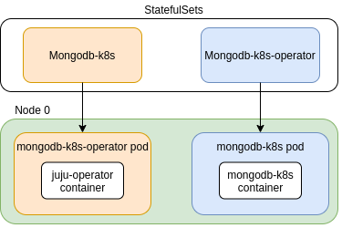
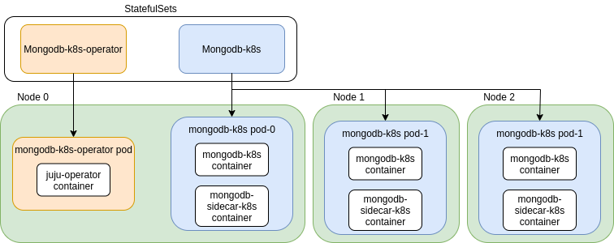

Juju Charm for MongoDB on Kubernetes
==================================

CI Badges
---------

Click on each badge for more details.

| Branch | Build Status | Coverage |
|--------|--------------|----------|
| master | [](https://travis-ci.org/majduk/charm-k8s-mongodb.svg?branch=master) | [](https://coveralls.io/github/majduk/charm-k8s-mongodb) |


Overview
---------

MongoDB for Juju CAAS

Usage
---------

To use, first pull in dependencies via `git submodule`:

```bash
git submodule init
git submodule update
```

Then, deploy the charm with an appropriate image resource:

```bash
juju --debug deploy . --resource mongodb-image=mongo:3.1 --resource mongodb-sidecar-image=mongo-sidecar:3.1
```

### Scale out usage
To add a replica to an existing service:
```bash
juju add-unit mongodb-k8s
```

### Scale down usage
In order to scale the units down with MongoDB PVCs termination an action needs to be run against last unit. Example for setup with 3 mongodb units:
```bash
juju run-action mongodb-k8s/2 remove-pvc
juju remove-unit -n 1 mongodb-k8s
```

### Connection
In order to connect to standalone mongodb host the URI is:
```bash
mongo mongodb://mongodb-k8s-0.mongodb-k8s:27017
```
Where ```bash mongodb-k8s-0``` is the name of a pod.

In order to connect to a replicaSet 'rs0' the URI is:
```bash
mongo mongodb://mongodb-k8s-0.mongodb-k8s:27017,mongodb-k8s-1.mongodb-k8s:27017,mongodb-k8s-2.mongodb-k8s:27017/?replicaSet=rs0
```
For more information on connection to MongoDB see https://docs.mongodb.com/manual/reference/connection-string/#mongodb-uri.

Architecture
---------
No-HA scenario architecture overview:



HA-scanario architecture overview:




